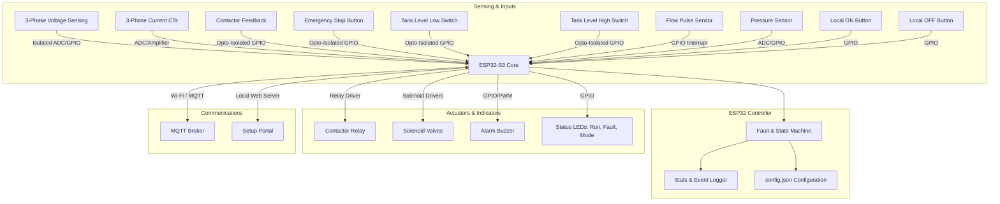

# IoT Submersible Pump Starter Controller - Implementation Plan

We are building a robust, industrial-grade 3-phase submersible pump motor starter controller using MicroPython on the ESP32. This controller handles motor protection, water automation, multiple control modes, logging, and communications (Wi-Fi, MQTT, local AP setup).

---

## 1. System Architecture



---

## 2. Hardware Block Diagram & Wiring Explanation

- **Microcontroller**: ESP32-S3 with 8MB Flash.
- **Voltage Sensing**: 3-Phase isolation using ZMPT101B voltage transformer modules or opto-coupler zero-cross/threshold detectors.
- **Current Sensing**: 3-Phase current sensing using split-core CT sensors (e.g., SCT-013-030) connected to ADC pins with burden resistors and DC bias (1.65V).
- **Control Inputs**: Tank floats, Flow sensor, Emergency Stop, and Contactor feedback are opto-isolated (using PC817) to prevent high-voltage noise from the pump starter panel.
- **Outputs**: Relays to switch the starter coil (normally 230V or 415V AC). Opto-triac trigger or power relay with snubbers.

---

## 3. MQTT Topic Design & JSON Payloads

### Telemetry Topic: `pump/<client_id>/telemetry`
Published every 5-10 seconds.
```json
{
  "timestamp": "2026-06-24T02:00:00Z",
  "motor_status": "ON",
  "mode": "AUTO",
  "voltages": [232.5, 230.1, 229.4],
  "currents": [12.4, 12.5, 12.1],
  "power_factor": 0.85,
  "est_kwh": 145.2,
  "runtime_hours": 32.5,
  "daily_runtime_sec": 7200,
  "tank_level": "MID",
  "flow_rate_gpm": 15.2,
  "pressure_psi": 42.0,
  "wifi_rssi": -65,
  "contactor_feedback": true
}
```

### Alert Topic: `pump/<client_id>/alerts`
Published immediately on state changes or fault conditions.
```json
{
  "timestamp": "2026-06-24T02:05:12Z",
  "event": "FAULT",
  "type": "DRY_RUN",
  "message": "Dry-run fault detected: Low current under load with no flow.",
  "voltages": [230.1, 229.8, 228.9],
  "currents": [2.1, 2.0, 2.2]
}
```

### Command Topic: `pump/<client_id>/command`
Received by the device.
```json
{
  "command": "PUMP_ON",
  "mode": "MANUAL",
  "zone": 1
}
```
Possible Commands: `PUMP_ON`, `PUMP_OFF`, `SET_MODE` (`AUTO`, `MANUAL`, `MAINTENANCE`), `CLEAR_FAULT`, `SET_CONFIG`.

---

## 4. Mobile App API & Database Schema (Device-Side Perspective)

### Database Schema (Local SQL/JSON Logger)
Stored on the ESP32's flash file system:
- **Event Log (`events.jsonl`)**: Log of commands, boots, mode changes.
  Format: `{"t": <epoch>, "e": <event_type>, "d": <details>}`
- **Fault Log (`faults.jsonl`)**: Historical record of motor faults.
  Format: `{"t": <epoch>, "f": <fault_type>, "v": [vA, vB, vC], "i": [iA, iB, iC]}`

### Setup Portal API
- `GET /api/status`: Returns current telemetry, Wi-Fi status, signals, faults.
- `POST /api/setup`: Update network settings (`wifi`, `mqtt`).
- `POST /api/config`: Calibrate CT/Voltage sensors, set protection thresholds.

---

## 5. Proposed Changes in MicroPython Firmware

We will add a modular, robust pump controller that integrates seamlessly into the existing MicroPython environment:

### 1. `[NEW] pump_controller.py`
This module will manage:
- FSM (Fault State Machine).
- ADC current/voltage calculations.
- Sensor inputs (flow, levels, e-stop, contactor feedback).
- Control outputs (contactor relay, valves, buzzer, LEDs).
- Local buttons and timer logs.

### 2. `[MODIFY] config.defaults.json` & `[MODIFY] config.json`
Update configurations to include all motor protection thresholds, timing, and pin allocations.

### 3. `[MODIFY] mqtt.py`
Update the MQTT thread to handle telemetry publishing, subscriptions to pump commands, and publishing alert payloads.

### 4. `[MODIFY] main.py`
Change the main thread loop to start the `pump_controller` thread and feed the thread watchdog.

---

## 6. Verification Plan

### Simulated/Manual Verification
- Run a simulation module `simulate_inputs.py` to change analog voltages, currents, and switch states.
- Verify that faults (e.g., over-voltage, dry-run, phase loss) trigger immediately, open the relay, activate the buzzer/fault LED, and publish alerts.
- Verify that recovery/restart delay works as expected.
- Test auto/manual switching and local buttons.

### Automated Tests
- Script a simulator that posts to the local HTTP REST interface and validates state transitions.

---

## 7. Python Environment & VS Code Task Configuration

### 7.1. Installing Anaconda / Miniconda (User Action)
1. **Download Miniconda (Recommended)** or Anaconda:
   - Go to [Miniconda Download Page](https://docs.anaconda.com/miniconda/) or [Anaconda Download Page](https://www.anaconda.com/download).
   - Download the Windows 64-bit installer.
2. **Run the Installer**:
   - Double-click the downloaded `.exe` installer.
   - Follow the prompt. You can install it for "Just Me" (default).
   - In the "Advanced Options" step, you can leave the options as default (it is not strictly necessary to add Anaconda/Miniconda to the system PATH, as we can run it from the **Anaconda/Miniconda Prompt**).
3. **Verify Installation**:
   - Search for **"Miniconda Prompt"** or **"Anaconda Prompt"** in the Windows Start menu and open it.
   - Run `conda --version` and `python --version` to verify it works.

### 7.2. Creating the Local Python Virtual Environment (venv)
Once Anaconda/Miniconda is installed:
1. Open the **Miniconda Prompt** / **Anaconda Prompt**.
2. Navigate to your project folder:
   ```cmd
   cd /d "E:\00.0. Jayanti Baraiya - NSAShared\04.A ESP32\esp32_starter"
   ```
3. Create a local virtual environment named `.venv` in your project folder using Conda's Python:
   ```cmd
   python -m venv .venv
   ```
4. Activate the virtual environment in the prompt:
   ```cmd
   .venv\Scripts\activate
   ```
5. Install the required libraries and tools for ESP32 MicroPython communication:
   ```cmd
   pip install mpremote esptool adafruit-ampy pyserial
   ```

### 7.3. Updating VS Code Settings
We will configure VS Code to use this project-specific virtual environment.
- Modify `settings.json` to point VS Code's Python extension to the environment's interpreter.
- Update `tasks.json` to invoke the absolute executables:
  - `${workspaceFolder}/.venv/Scripts/mpremote.exe` instead of `mpremote`
  - `${workspaceFolder}/.venv/Scripts/python.exe` instead of `python`
  - `${workspaceFolder}/.venv/Scripts/ampy.exe` instead of `ampy`
- For file copying tasks, we use a Python one-liner with `glob` and `subprocess` instead of PowerShell loops. This prevents any shell quoting errors if the project path contains spaces (such as `E:\00.0. Jayanti Baraiya - NSAShared\...`).

This makes all VS Code upload and utility tasks self-contained and run without needing global environment PATH configuration.

---

## 8. Display Status Integration

We are adding support for a 320x240 ST7789 display (such as the one on the user's board) to show the pump starter controller's active status, system mode, phase voltages, currents, tank water levels, flow rate, pressure, and active faults.

### 8.1. Configuration Updates
We will add a new `display` configuration block in `config.defaults.json` and `config.json`:
```json
  "display": {
    "enabled": true,
    "width": 320,
    "height": 240,
    "rotation": 1,
    "xstart": 0,
    "ystart": 0,
    "pins": {
      "dc": 39,
      "sck": 41,
      "mosi": 40,
      "rst": 42,
      "cs": 47,
      "backlight": 46
    }
  }
```

### 8.2. Display Manager (`display_manager.py`) [NEW]
We will create a new Python module `display_manager.py` that:
- Initializes the ST7789 display using SPI.
- Runs a background thread `display_thread` to prevent blocking the main FSM and sensor loop.
- Reads `pump_controller.state`, `pump_controller.telemetry`, and `pump_controller.active_faults`.
- Renders a clean status dashboard:
  - **Header Banner**: Color-coded based on the state (Gray for OFF, Green for RUNNING, Red for TRIPPED, Yellow for STARTING/RESTART_DELAY). Shows the system mode (AUTO/MANUAL) and name.
  - **Telemetry columns**:
    - Left column displays average and individual phase voltages (Va, Vb, Vc) and currents (Ia, Ib, Ic).
    - Right column displays water automation states (Tank level, Flow rate, pressure, WiFi connectivity).
  - **Footer**: Shows active fault strings or timers (e.g. countdown for restart delay).

### 8.3. Main Integration (`main.py`)
Modify `main.py` to import `display_manager` and call `display_manager.start()` if display is enabled in config.

---

## 9. Hardware-Triggered Pairing/Setup Mode

We are implementing a physical button trigger to bring the ESP32 Pump Starter Controller into pairing/setup mode (Access Point mode) without needing to configure it beforehand.

### 9.1. Setup Button Pin Assignment
- We will define a setup button GPIO pin in the configuration. By default, it will be mapped to **GPIO 0** (which is the physical **BOOT/PRG** button built into almost all ESP32 development boards):
  - `"btn_setup": 0` under `pump.pins` in `config.defaults.json` and `config.json`.

### 9.2. Boot-Time Trigger (`main.py`)
- During the boot sequence, if the setup button (GPIO 0) is held down for **3 seconds**, the device will temporarily force Access Point (`ap`) mode. This provides a hard override in case the device gets stuck trying to connect to a configured WiFi network.

### 9.3. Runtime Trigger (`pump_controller.py`)
- During normal operation, the background `pump_thread` will monitor the setup button pin.
- If the button is held pressed (active-low, pin value `0`) for **5 seconds**:
  - The controller will turn OFF the contactor relay and buzzer for safety.
  - It will update the configuration to set `"client": {"mode": "ap"}`.
  - It will save the configuration to disk.
  - It will perform a system reset (`machine.reset()`) to boot into the provisioning Access Point portal.

### 9.4. Display Setup Portal Dashboard (`display_manager.py`)
- If the system starts up in Access Point setup mode (`client.mode == "ap"`):
  - The screen will display a distinct **Pairing Mode** dashboard:
    - **Header Banner**: Solid Blue (`0x001F`) with white text reading `"PAIRING MODE ACTIVE"`.
    - **Body Information**:
      - `"To configure this device:"`
      - `"1. Connect to WiFi network:"`
      - `"   SSID: ESP32_Pump_Setup"`
      - `"   Pass: 12345678"`
      - `"2. Open mobile app or browser"`
      - `"   IP: 192.168.4.1"`
    - **Footer Status**: Shows active setup connection info (how many clients are connected to the AP).

---

## 10. Ecosystem-Standard OTA Update Flow

We are implementing a standardized, lightweight OTA update check that avoids unnecessary file downloads and provides version visibility to the ecosystem broker.

### 10.1. Version Configurations
We will define key version parameters in the `client` configuration block inside `config.defaults.json` and `config.json`:
- `"type"`: `"pump"` (Device type identifier)
- `"hardware_version"`: `"esp32_1.0"` (Hardware architecture identifier)
- `"firmware_version"`: `"firmesp32_v2"` (Current firmware code version)

### 10.2. Version Announcement on Startup (`mqtt.py`)
- Upon connecting successfully to the MQTT broker, the device will announce its online status, IP address, and firmware version.
- **Topic**: `{type_of_device}/{hardware_version}/status`
  - Example: `pump/esp32_1.0/status`
- **Payload**: JSON dictionary reporting device statistics:
  ```json
  {
    "client_id": "esp32_pump_01",
    "status": "online",
    "firmware_version": "firmesp32_v2",
    "ip": "192.168.1.104",
    "rssi": -65
  }
  ```
- This keeps the topic paths static and makes it extremely simple for the broker/backend to subscribe to status updates (e.g., `pump/+/status`).

### 10.3. Local Version Check before Download (`mqtt.py`)
- When receiving an OTA command payload on the command channel:
  ```json
  {
    "command": "OTA",
    "version": "firmesp32_v3",
    "manifest": true
  }
  ```
- The client will check the target `"version"` string.
- If the target `"version"` matches the client's current `"firmware_version"`:
  - The client skips fetching any files or manifests.
  - It prints: `ℹ️ Firmware is already up to date: firmesp32_v2`
  - It publishes a status update back to the server: `Already on version firmesp32_v2`
- If the versions differ (or no version parameter is provided), the client will fetch the manifest/files and apply the update.


