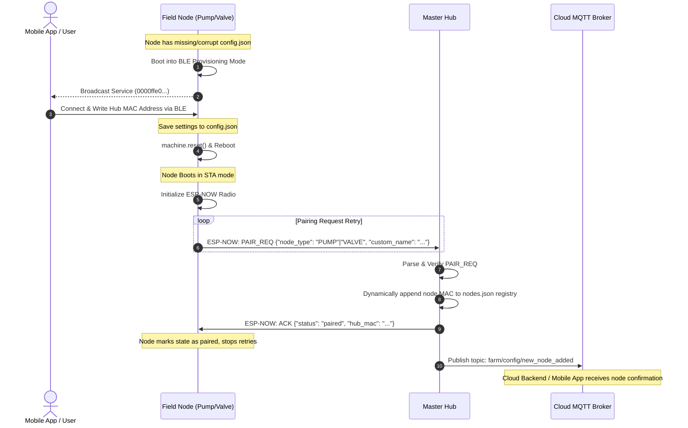

# Inter-Device Association & Pairing Flow

This document details the handshake sequence for connecting new field nodes (Pump Controller or Valve Controller) to the Master Hub Central Controller.

## Sequence Diagram



---

## Detailed Step-by-Step Handshake Sequence

### Step 1: Device Initialization & Fallback
A new, unconfigured field node boots. The startup code loads settings from local storage.
- If `config.json` is missing, corrupt, or contains an unconfigured Hub MAC address (`00:00:00:00:00:00`), the device enters **BLE Provisioning Mode**.
- It blinks both the Run and Fault status LEDs as feedback and starts advertising.

### Step 2: BLE Provisioning
A mobile application scanning for setup devices connects to the BLE advertising payload (e.g. `pump_node_01_Setup` or `valve_node_01_Setup`).
- The mobile app writes a JSON configuration payload to GATT Write Characteristic `0000ffe1-0000-1000-8000-00805f9b34fb`.
  - For **Valve Controllers**, the payload contains the Master Hub's MAC Address, target parent MAC Address (if multi-hop relaying is required), custom name, and node ID.
  - For **Pump Controllers**, the payload contains the Master Hub's MAC Address, custom name, and node ID.
- The node updates its local `config.json` file on flash, changes its mode to normal station mode (`"mode": "sta"`), and invokes `machine.reset()` to reboot.

### Step 3: Local Network Handshake Request
Upon rebooting in normal station mode, the field node initializes its ESP-NOW radio using the 802.11 STA interface.
- It builds a standard JSON envelope:
  ```json
  {
    "msg_type": "PAIR_REQ",
    "target_mac": "HUB_MAC_ADDRESS_HERE",
    "routing_path": ["HUB_MAC_ADDRESS_HERE"],
    "current_hop_index": 0,
    "payload": {
      "node_type": "PUMP" | "VALVE",
      "custom_name": "Configured Node Name"
    }
  }
  ```
- The node transmits this payload over ESP-NOW to the configured Hub MAC address.
- It retries this transmission every 5 seconds until it receives an acknowledgment.

### Step 4: Master Hub Association & Registry Update
The Master Hub's ESP-NOW receiver processes the incoming packet.
- Upon receiving a `"msg_type": "PAIR_REQ"`, the Hub extracts the sender's hardware MAC address.
- It verifies the payload and dynamically registers the MAC address by appending it to the local `nodes.json` registry file on the Hub's flash.
- The Hub returns an ESP-NOW ACK confirmation back to the node:
  ```json
  {
    "msg_type": "ACK",
    "target_mac": "NODE_MAC_ADDRESS_HERE",
    "routing_path": ["NODE_MAC_ADDRESS_HERE"],
    "current_hop_index": 0,
    "payload": {
      "status": "paired",
      "hub_mac": "HUB_MAC_ADDRESS_HERE"
    }
  }
  ```
- The field node receives the ACK, marks its internal status as `paired = True`, and switches to normal telemetry/command mode (discontinuing periodic pairing requests).

### Step 5: Cloud WAN Announcement
Simultaneously, the Hub translates this local mesh pairing event into a global cloud notification.
- It publishes a status update to the MQTT Broker.
- **Topic**: `farm/config/new_node_added`
- **Payload**:
  ```json
  {
    "mac": "NODE_MAC_ADDRESS_HERE",
    "node_type": "PUMP" | "VALVE",
    "custom_name": "Configured Node Name"
  }
  ```
- The cloud backend and mobile application display the new node on the dashboard under active farm components.
